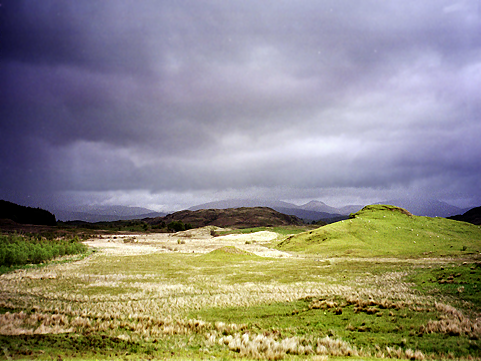
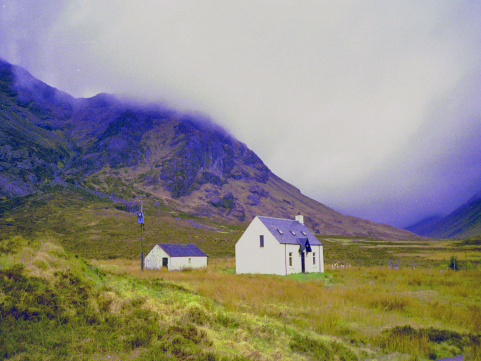

# color_transfer_MKL
This is torch implemented for the color transfer using Monge-Kantorovitch Linear with GPU mode

	This package contains one script to run color mapping algorithm as described in 

	[Pitie07b] The linear Monge-Kantorovitch linear colour mapping for
	example-based colour transfer. F. Pitié and A. Kokaram (2007) In 4th
	IEE European Conference on Visual Media Production (CVMP'07). London,
	November.

# Setup

	The codes are tested on Ubuntu 16.04 + Torch7 + CUDA8.0.

	1. install Torch7 with GPU mode
			Please follow the tutorial on http://torch.ch/docs/getting-started.html#_
	2. install CUDA 
			Please download CUDA and follow the instructions on https://developer.nvidia.com/cuda-downloads

# Basic Usage

	'''Bash
	th color_transfer_MKL.lua

	
# Examples

<table style="width:100%">
<tr>
<td></td>
<td></td>
</tr>
<tr>
<td>input ref</td>
<td>input target</td>
</tr>
<tr>
<td></td>
<td></td>
</tr>
<tr>
<td>Linear Monge-Kantorovitch solution in RGB space</td>
<td></td>
</tr>
</table>

# Notice 
	The pictures on this website are released free of copyrights.
